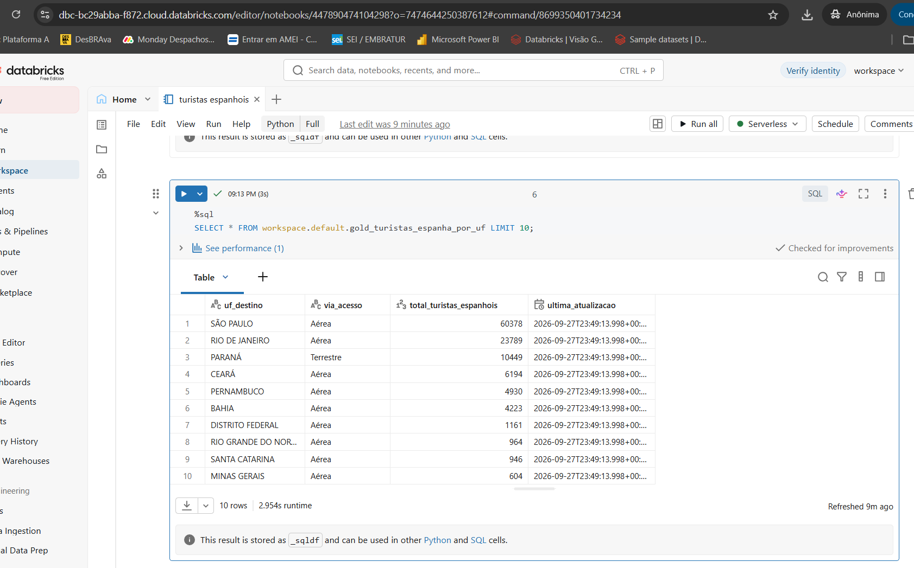

# MVP - Pipeline de Dados de Turismo Internacional: Mercado Emissor Espanha

> **Projeto Prático - Pós-Graduação PUC-Rio**  
> Pipeline de dados desenvolvido em Arquitetura Medalhão no Databricks

## 1. Visão Geral e Objetivo do Negócio

A Espanha ocupa a 6ª posição no ranking de mercados emissores de turistas internacionais para o Brasil. O objetivo deste projeto é tratar e agregar os dados brutos de chegadas de visitantes espanhóis de janeiro a agosto de 2026, para responder seguintes a questões:

* **Volume de Chegadas:** Qual a quantidade acumulada de visitantes espanhóis nos estados brasileiros no período?
* **Distribuição Regional:** Quais são os principais estados de destino (UFs) e polos de atração?
* **Vias de Acesso:** Qual a representatividade do modal aéreo em comparação com o terrestre e aquaviário?
* **Governança do Pipeline:** Qual foi o carimbo de data e hora da última atualização dos dados?

## 2. Marco Temporal e Abrangência dos Dados

* **Período de Análise:** Janeiro a Agosto de 2026 (Acumulado até ao mês de Agosto);
* **Granularidade:** Dados consolidados mensalmente por Unidade da Federação (UF) e via de acesso (Aérea, Terrestre, Marítima e Fluvial);
* **Filtro Aplicado na Camada Silver:** Mercado emissor da Espanha (origem de 116.840 visitantes no período acumulado de 2026);
* **Data da Última atualização no Pipeline:** Registo dinâmico capturado na coluna `ultima_atualizacao` na Camada Gold via `current_timestamp()`.

## 3. Arquitetura da Solução (Arquitetura Medalhão)

O pipeline segue a padronização Medalhão para garantir rastreabilidade, qualidade e integridade do dado:

### Camada Bronze (`workspace.default.bronze_chegadas_turistas`)

Ingestão dos dados brutos em formato Delta Lake, aplicação de padronização do delimitador `;`, tratamento de arrays com a função `get()` para prevenção de exceções de índice e criação da coluna de metadados de ingestão (`data_ingestao`);

### Camada Silver (`workspace.default.silver_chegadas_espanha`)

Limpeza de caracteres Unicode corrompidos (`\uFFFD`), correção e padronização da acentuação dos nomes dos estados e vias de acesso com `regexp_replace`, conversão de tipos numéricos e filtragem exclusiva do mercado da Espanha;

### Camada Gold (`workspace.default.gold_turistas_espanha_por_uf`)

Consolidação dos dados para consumo analítico e suporte à tomada de decisão, contendo as somatórias de passageiros por estado e via de transporte;

## 4. Evidência de Execução e Resultados (Camada Gold)

Abaixo encontra-se a captura de ecrã da consulta à tabela Gold no Databricks após o processamento completo do pipeline: 


## 5. Dicionário de Dados (Tabela Gold)

| Coluna | Tipo | Descrição |
| --- | --- | --- |
| `uf_destino` | `STRING` | Estado brasileiro (UF) de entrada/desembarque do visitante |
| `via_acesso` | `STRING` | Modal de transporte utilizado (`Aérea`, `Terrestre`, `Marítima`, `Fluvial`) |
| `total_turistas_espanhois` | `BIGINT` | Somatório acumulado de turistas espanhóis no período |
| `ultima_atualizacao` | `TIMESTAMP` | Registo do carimbo de data/hora do processamento no Delta Lake |


## 6. Tecnologias Utilizadas

* **Databricks Community / Serverless**
* **Apache Spark / PySpark & Spark SQL**
* **Delta Lake & Unity Catalog**
* **Git / GitHub**

```
